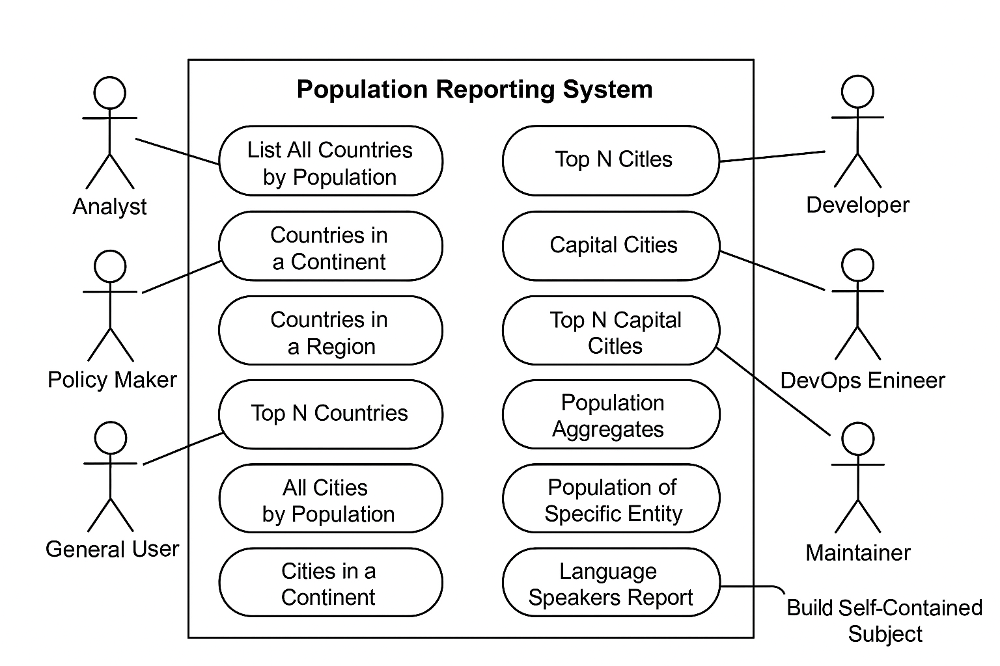

# USE CASE DIAGRAM – World Population Reporting System

This diagram illustrates the interactions between three primary user roles and the system's core functionalities.

## Actors
- **Data Analyst**
- **Policy Maker**
- **General User**

## Use Cases by Actor

### Data Analyst
- View All Countries by Population
- View Cities by Population
- View Language Speaker Statistics

### Policy Maker
- View Countries by Region
- View Top N Cities
- View Population Breakdown

### General User
- View Top N Countries
- View Cities by Country/District
- View Capital Cities

## Diagram Preview

